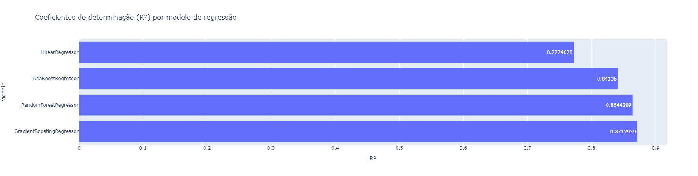
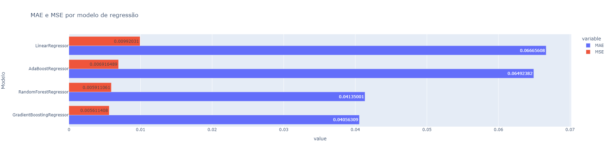

# Case - Seleção do melhor modelo de regressão para prever custo de seguros

## Ojetivo do projeto

Selecionar o melhor modelo de machine learning de regressão para calcular o custo do seguro de clientes de uma empresa.

## Bibliotecas utilizadas

Segue uma lista com as bibliotecas utilizadas no desenvolvimento e resolução deste case.
- pandas
- numpy
- matplotlib
- seabron
- plotly
- statsmodels
- sklearn

## Deployment

Para executar o projeto é necessário baixar o arquivo "case_preco_seguros.ipynb" (código do projeto) e o database "insurance.xlsx". Feito isso, salvar ambos os arquivos na mesma pasta e executar o código utilizando programas de visualização e leituras de códigos em jupyter notebook, como Visual Studio Code por exemplo, ou algum outro software similar.

Obs: para executar o código corretamente as bibliotecas listadas na sessão anterior precisam estar instaladas em sua máquina.

## Resultados

Seguem abaixo os gráficos com as métricas de performance de cada um dos modelos de regressão linear e não linear testados como possíveis soluções do case.

- R² por modelo:

- MAE e MSE por modelo:

## Conclusão

Desta forma, concluí-se que o modelo a apresentar os melhores resultados neste projeto foi o Gradient Boosting Regressor, tendo o coeficiente de determinação mais alto e os valores de MAE e MSE mais baixos. Este resultado condiz com o gráfico de dispersão plotado na sessão de estatística descritiva, onde nenhuma das variáveis explicativas mostrou ter uma relação linear com a variável target "custos_seguro", indicando que o provável modelo de machine learning a ter a melhor performance seria um de regressão não linear.

Deixo como sugestão a trabalhos futuros fazer a otimização dos hiperparâmetros deste modelo de Gradient Boosting Regressor, buscando métricas ainda melhores.